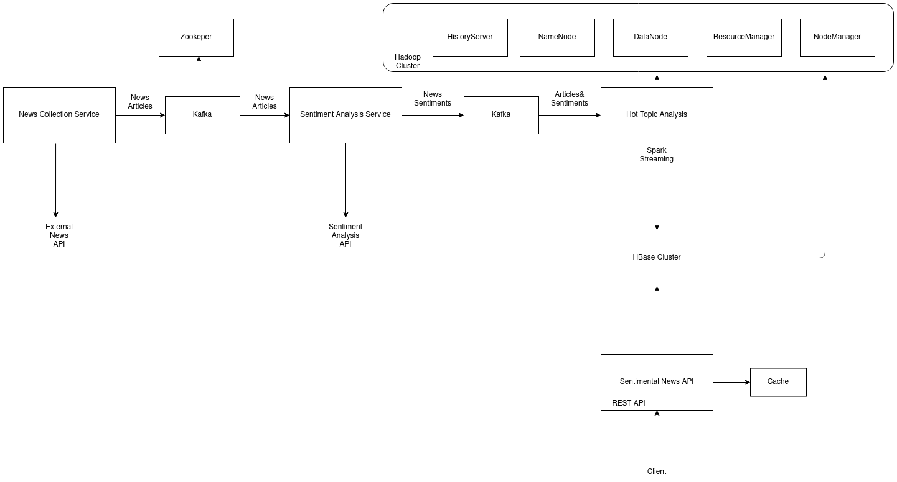

# Most Sentimental News API

>Definition of *sentimental*: marked or governed by feeling, sensibility, or emotional idealism                                                                      

The aim of this project is to provide an API that provides the most sentimental NEWS in the world (mostly us).

The architecture of the project is shown in the following diagram.

1. News Collection Service

   The News Collection Service fetches NEWS from an endpoints parses them and sends them to a Kafka data store.

2. Sentimental Analysis Service

   The Sentimental Analysis Service receives the News articles from Kafka and uses a Machine Leaning endpoint to compute their sentimental information. It then pushes this information to another Kafka topic.

3. Hot Topic Analysis Service

   The Hot Topic Analysis Service is a Spark Stream services that uses a window to compute the most sentimental news in a time window. It stores this information into an HBase database. The streaming services uses HDFS for check-pointing and recovery.

4. Sentimental News API Service

   The Sentimental News API Service is a REST API service that responds to client requests to fetch various sentiments. It uses a cache to store time based sentiments so future requests are processed faster.

### Building and Running Application

The application comes with a `docker-compose.yml` file that lists all the services it needs.

It also includes a `Makefile` with some utility commands for building and running the application.

This means you should have `cmake` and `Docker`, and `Docker Compose` installed.

1. Building components: 

   You can easily build all the components by running: `make build`. For the details of the commands that are run, you can reference the `Makefile`.

2. Running background services:

   For the application to work properly, you need to start the background services that the services rely upon. Example Kafka, HBase. You can start these by running the command: `make start`.

3. Running app services:

   After the background services are initialized, you can run the main component of the application by running the command: `make app` or `make restart-app`.

4. Stopping app services:

   To stop the main components of the pipeline, run the command: `make clean`.

5. Stopping all services:

   To stop all services including the background services, run the command: `make clean-all`.

#### Demo Video Link (on Microsoft Stream)

> Put link here

#### Acknowledgements:

1. Mrudula Mukadam (Associate Chair and Assistant Professor at Maharishi International University). Comprehensive introduction to Big Data Technologies course.
2. All my Team at Telnyx LLC. for the first hand experience.

#### References:

1. Designing Data-Intensive Applications: The Big Ideas Behind Reliable, Scalable, and Maintainable Systems (https://www.google.com/url?sa=t&rct=j&q=&esrc=s&source=web&cd=&cad=rja&uact=8&ved=2ahUKEwjrlebDg5nzAhVGFFkFHTdvDrIQFnoECAIQAQ&url=https%3A%2F%2Fwww.amazon.com%2FDesigning-Data-Intensive-Applications-Reliable-Maintainable%2Fdp%2F1449373321&usg=AOvVaw0T6a9Z2m4rHbndFXgGcWry)
2. https://docs.rapidapi.com/
3. https://datanews.io/docs/headlines
4. https://www.big-data-europe.eu/

